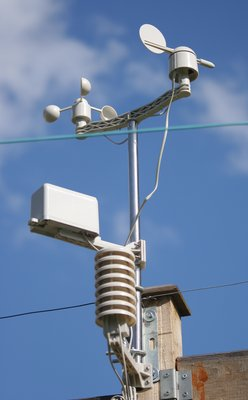

.. pywws - Python software for USB Wireless Weather Stations
   http://github.com/jim-easterbrook/pywws
   Copyright (C) 2008-15  pywws contributors

   This program is free software; you can redistribute it and/or
   modify it under the terms of the GNU General Public License
   as published by the Free Software Foundation; either version 2
   of the License, or (at your option) any later version.

   This program is distributed in the hope that it will be useful,
   but WITHOUT ANY WARRANTY; without even the implied warranty of
   MERCHANTABILITY or FITNESS FOR A PARTICULAR PURPOSE.  See the
   GNU General Public License for more details.

   You should have received a copy of the GNU General Public License
   along with this program; if not, write to the Free Software
   Foundation, Inc., 51 Franklin Street, Fifth Floor, Boston, MA  02110-1301, USA.

.. include:: ../../README.rst

Documentation is available in the following languages (non-English versions may not be complete or up to date):
   * `English <http://pywws.readthedocs.org/en/>`_
   * `Français <http://pywws.readthedocs.org/fr/>`_ -- translated by Jacques Desroches
   * `Italiano <http://pywws.readthedocs.org/it/>`_ -- translated by Edoardo

I have written this software to meet my needs, but have tried to make it adaptable to other people's requirements. You may want to edit some or all of the modules, or write some new ones, to get it to do exactly what you want. One of the reasons for using Python is that it makes such alterations so easy. Don't be afraid, just jump in and have a go.

************
Requirements
************

The software you'll need to run pywws depends on what you plan to do with it.
You'll need Python 2.5 or later -- Python 3 is partially supported, some functionality depends on libraries that have not yet been ported to Python 3.

For more detail, see :doc:`essentials/dependencies`.

******************************
Installing and upgrading pywws
******************************

pywws can be installed directly from the `Python Package Index (PyPI) <http://pypi.python.org/pypi/pywws/>`_ using the pip command.
See :doc:`guides/getstarted` for full instructions.

Some new versions of pywws change what's stored in the hourly, daily or monthly summary data files.
These new versions are incompatible with processed data from earlier versions.
The :py:mod:`pywws.Reprocess` script regenerates all the summary data. It should be run after any major upgrade.

*************
Documentation
*************

Documentation is included with pywws downloads, and is also available `online <http://pythonhosted.org/pywws>`_. A good starting place is :doc:`guides/getstarted` which describes in more detail how to install pywws.

If you have questions not answered in the documentation, please join the `pywws Google mailing list / discussion group <http://groups.google.com/group/pywws>`_ and ask there. Note that your first message to the group will not appear immediately -- new posters have to be approved by a moderator, to prevent spam messages.

Contents
========

.. toctree::
   :maxdepth: 2

   Licence <essentials/LICENCE>
   pywws Contributors <copyright>
   Dependencies <essentials/dependencies>
   Change log <essentials/CHANGELOG>
   User guides <guides/index>
   Python modules <api_index>

Indices and tables
==================

* :ref:`genindex`
* :ref:`modindex`
* :ref:`search`

*******
Credits
*******

I would not have been able to get any information from the weather station without access to the source of Michael Pendec's "wwsr" program. I am also indebted to Dave Wells for decoding the `weather station's "fixed block" data <http://www.jim-easterbrook.me.uk/weather/mm/>`_.

Last of all, a big thank you to all the pywws users who have helped with questions and suggestions, and especially to those who have translated pywws and its documentation into other languages.

********
Legalese
********

| pywws - Python software for USB Wireless WeatherStations.
| http://github.com/jim-easterbrook/pywws
| Copyright (C) 2008-15  :doc:`pywws contributors <copyright>`

This program is free software; you can redistribute it and/or modify it under the terms of the GNU General Public License as published by the Free Software Foundation; either version 2 of the License, or (at your option) any later version.

This program is distributed in the hope that it will be useful, but WITHOUT ANY WARRANTY; without even the implied warranty of MERCHANTABILITY or FITNESS FOR A PARTICULAR PURPOSE. See the GNU General Public License for more details.

You should have received a copy of the `GNU General Public License <essentials/LICENCE.html>`_ along with this program; if not, write to the Free Software Foundation, Inc., 51 Franklin Street, Fifth Floor, Boston, MA 02110-1301 USA